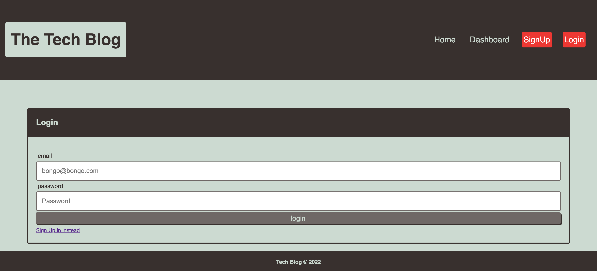
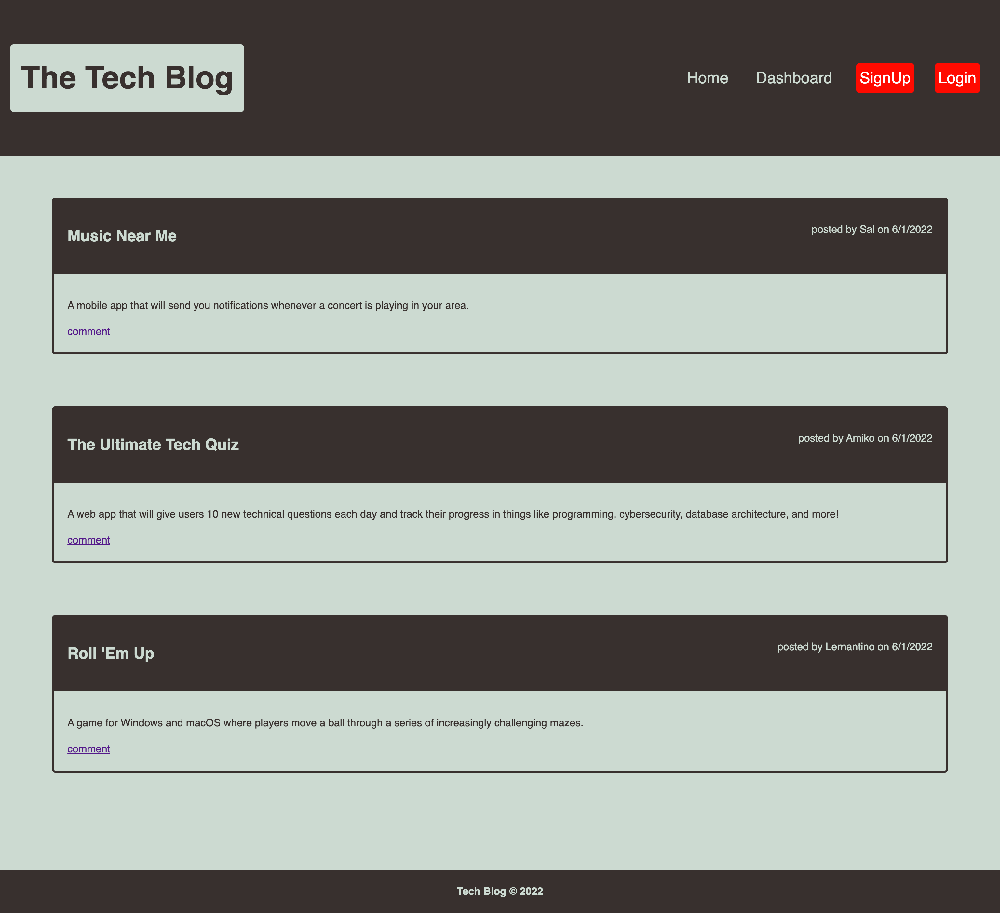

# Tech-Blog

## Table of content

- [Description](#description)
- [Installation](#installation)
- [Usage](#usage)
- [License](#license)
- [Contributing](#contributiing)
- [Test](#test)
- [Questions](#questions)
- [Screenshots](#screenshots)
- [Links](#links)
- [Screenshot](#screenshot)

## Description

This is a CMS-style blog site that allow a user to create an account and share their blog posts, thoughts and opinion. It als aslo allow other user to comment on any post created.

## Installation

```
1. git clone from my repo: https://github.com/bongomin256/Tech-Blog.
2. cd to the directory you have cloned.
3. run npm i in your terminal to install all the dependencies.
4. Navigate to .env.Example file and change the placeholder with your username and password.
```

#### Running mysql database

```
$ mysql -u root -p
$ source db/schema.sql
$ npm run seed
$ npm start
```

## Usage

```
$ npm start
```

## License

.
The license's link [MIT](https://opensource.org/licenses/MIT)

## Contribution

Connect with me through my [Github profile](https://github.com/bongomin256) or [E-mail](bongomin@uw.edu) in order to contribute to this project.

## Test

```
Use insomia to test.
```

## Questions

This is the link to my [Github profile](https://github.com/bongomin256)
Incase of any question[s] or suggestion[s] concerning this appication, please contact me through this email [bongomin@uw.edu](bongomin@uw.edu)

## Links

- [Github app repo](https://github.com/bongomin256/Tech-Blog)
- [Link to Heruko deployed app](https://desolate-waters-20232.herokuapp.com/)

## Screenshots



